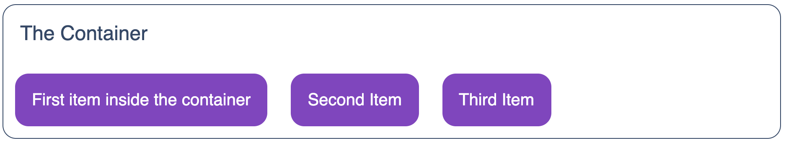
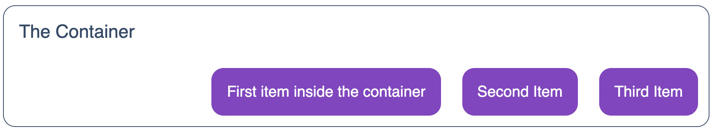
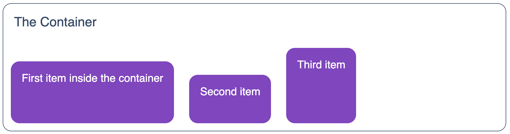
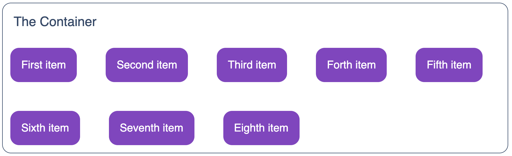

# CSS Flexbox: A Complete Guide with Examples


## Introduction

In this article, we will cover what is flexbox, a few applications where flexbox is used, how to get started with flexbox and what properties are available to use.  In case that you don't know exactly how the content in your webpage is going to look at the end, but you want to have a clean project where all the items are fitted perfectly, learn that flexbox is the ideal layout system that you would want to use. We hope that this article will come in hand to realize beautiful projects.

## 1. What is flexbox?

The Flexible Box Module, generally referred to as flexbox, was introduced in 2009 as a new way to easily organize elements and to design responsive webpages. In the following years it gained so much popularity that today is used as the main layout system for the most of the webpages. In order to have this module applied into your project, you will have to create a main container and use the `display: flex` property on it.

Flexbox layout is appreciated because it allows to build designs based on two axes: the main axis and the cross axis. This feature gives the container the power to dynamically set the width/height of its items in order to fill all the available space.

**How flexbox 'works'**


- main axis – This axis is the primary one. The flex items are displayed along the main axis.
- main-start | main-end – The flex items will be displayed from the 'main-start' to the 'main-end'.
- cross axis – This axis is perpendicular to the main axis.
- cross-start | cross-end – The flex items inside a container will fill the flex lines starting from the 'cross-start' and heading to the 'cross-end'.

### Supported browsers

If you want to check on which browsers and versions flexbox is supported, you can have a look on <a href="https://caniuse.com/?search=flexbox" target="_blank">https://caniuse.com/?search=flexbox</a>.


## 2. Flexbox Applications

### Bootstrap
This front-end open source toolkit helps you to design and customize responsive webpages using Sass variables and mixings, responsive grid system and so much more. The pre-build full suite of responsive flexbox utilities gives you the power to manage the layout, 	alignment, sizing of grid columns and many others, which makes Bootstrap one of the most popular CSS framework.

If you want to create complex and innovative designs, check our latest Premium Bootstrap 5 UI Kit: [https://www.creative-tim.com/product/soft-ui-design-system-pro](https://www.creative-tim.com/product/soft-ui-design-system-pro)

### Tailwindcss
This utility-first CSS framework based on flexbox helps you to build any design directly in your markup. It's biggest advantage is that you can rapidly create modern websites without 	leaving your HTML code. It's also easy to customize and adapts to any design.

If you need a components library for tailwind css, you can check the below product: [https://www.creative-tim.com/product/notus-pro-react](https://www.creative-tim.com/product/notus-pro-react)

### Bulma
This open source CSS framework is build with Sass and it's based on flexbox. Among it's advantages is that it's available for free and be used to build 100% responsive webpages. It's also fully modular, which allows you to import only what you need from the 29 SASS files that you can import individually. 


## 3. Get started with flexbox
In the next section we will present to you the flexbox properties and the most commonly used values for them, structured into categories. Firstly we will cover the properties that applies to the parent (container) and then we will move on to the ones that are applying to the childrens (items). 
	
### 3.1. Parent properties (container)

**display**

In order to get started with flexbox, first you will need to set the container's display property to flex.

`display: flex;` property example



Syntax:
```
.container {
    display: flex;
}
```

or 

```
.container {
    display: inline-flex;
}
```

**flex-direction**

This property allows you to decide on the main axis direction in your container. By default, the main axis is from left to right.

`flex-direction: row-reverse;` property example


Syntax:
```
.container {
    flex-direction: row | row-reverse | column | column-reverse;
}
```

- row (default): left to right
- row-reverse: right to left
- column: top to bottom
- column-reverse: bottom to top

**justify-content**

Determines how the actual element (content) is distributed across the main axis.

`justify-content: flex-end;` property example



Syntax:
```
.container {
    justify-content: flex-start | flex-end | center | space-between | space-around | space-evenly;
}
```

- flex-start (default): items are moved toward the start of the main axis
- flex-end: items are moved toward the end of the main axis
- center: items are centered along the main axis
- space-between: items are evenly distributed along the main axis, with the mention that the first and the last items are pushed to the extremities of the main axis
- space-around: items are evenly distributed along the main axis, with the mention that all the items have equal space on both sides, which will visually create unequal space between the items
- space-evenly: items are evenly distributed along the main axis, with the mention that all the spaces will be equal (including the spaces from the extremities to the item)
 
**flex-wrap**

It determines whether your items are going to wrap along the main axis onto a new line if it's horizontal or a new column if it's a vertical main axis.

`flex-wrap: nowrap;` property example


`flex-wrap: wrap;` property example


Syntax:
```
.container {
    flex-wrap: nowrap | wrap | wrap-reverse; 
}
```

- nowrap (default): all items will be on one line
- wrap: items will wrap onto multiple lines, from top to bottom
- wrap-reverse: items will wrap onto multiple lines from bottom to top

**align-items**

This property is going to distribute the items along the cross axis.

`align-items: flex-start;` property example


`align-items: flex-end;` property example




Syntax:
```
.container {
    align-items: stretch | flex-start | flex-end | center | baseline;
}
```

- stretch (default): items are stretched to fill the container
- flex-start: items are placed at the start of the cross axis
- flex-end: items are placed at the end of the cross axis
- center: items are centered in the cross-axis
- baseline: items are aligned such as their baselines align

**align-content**

Used to control or distribute space along the cross axis, but only when you have multiple rows or columns.

`align-content: center;` property example


Syntax:
```
.container {
    align-content: flex-start | flex-end | center | space-between | space-around | space-evenly;
}
```

- flex-start: items are pushed to the start of the container
- flex-end: items are pushed to the end of the container
- center: items are centered in the container
- space-between: items are evenly distributed; the first line is at the start of the container while the last one is at the end
- space-around: items are evenly distributed with equal space around each line
- space-evenly: elemets are evenly distributed with equal space around them

**gap, row-gap, column-gap**

This property allows you to control the space between flex items. Please note that it applies only to the space __between items__.

`gap: 25px;` property example



Syntax:
```
.container {
    gap: 25px; /* both row-gap and column-gap */
    gap: 25px 50px; /* both row-gap and column-gap */
    row-gap: 25px;
    column-gap: 50x;
}
```

### 3.2. Children Properties (items inside a container)

**order**

This property allows you to change the order of the items displayed inside a container. The default value for each item is '0'.

Syntax:
```
.item {
    order: 5;
}
```

**flex-grow**

As the name suggest, this property will make the item grow in order to fill the free space from the container. The default value for each item is '0'.

Syntax:
```
.item {
    flex-grow: 4;
}
```

**flex-shrink**

This is similar to the previous property with the difference that the item will shrink, not grow, in order to fit the container's space. The default value for each item is '1'.

Syntax:
```
.item {
    flex-shrink: 3;
}
```

**flex-basis**

This property will allow you to set the initial size of an item. The default value is 'auto'.

Syntax:
```
.item { 
    flex-basis: content;
}
```

**flex**

This is actually a shorthand property for: flex-grow, flex-shrink and flex-basis. The default value is '0 1 auto'.

Syntax:
```
.item {
    flex: 0 1 100px;
}
```

**align-self**

This property allows you to override the alignment of an item even if the 'align-items' property is used.

Syntax:
```
.item {
    align-self: center;
}
```

## Conclusion

We know that creating responsive designs and accomodating UI in different screen sizes can be a real strugle so we hope that you will find this article useful for your future projects. Flexbox can ease up you work for creating beautiful designs by manipulating width, height and order of the elements. The process of creating the layouts for your websites will be a 'piece of cake' if you learn to take advantage of all the benefits that flexbox can offer.
